# Universal Prompt Studio

A browser-based prompt engineering studio. Fourteen guided builders turn plain-English ideas into structured, model-ready prompts for image and video generation, motion design, After Effects, audio, LLM chats, agents and agent loops, software, frontend design, marketing and project management. Pick a target model and the output also carries that model's prompting tips, limit warnings and native syntax.

**No installation or build step for the browser app. Open the HTML file with an internet connection.**

Optional [MCP agent access](mcp/README.md) supports agents on your PC or Raspberry Pi over your local network.

   

  <a href="screenshots/home.png">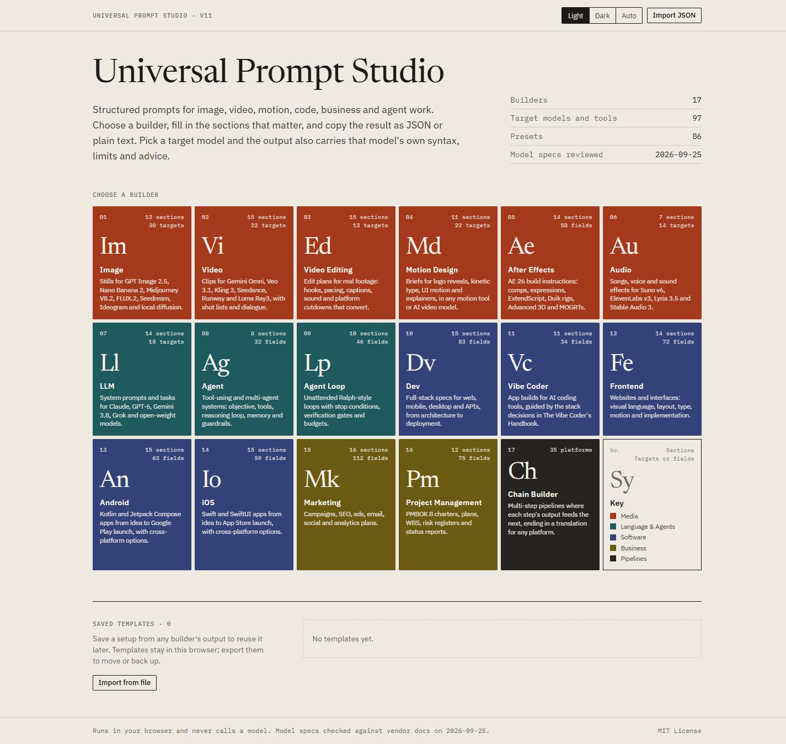</a>

## Quick Start

1. Download or clone this repo.
2. Open `universal-prompt-studio-v11.html` in any modern browser.
3. Pick a builder tile and start building.

Everything runs client-side in your browser. There is no server, no account and no API key, and the studio never calls a model.

## Screenshots

| | |
|---|---|
| [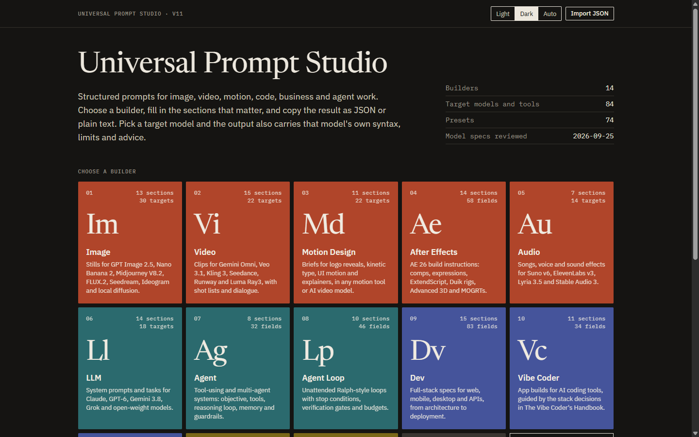](screenshots/home-dark.png) *Home in dark mode: builder families keep their deep hues* | [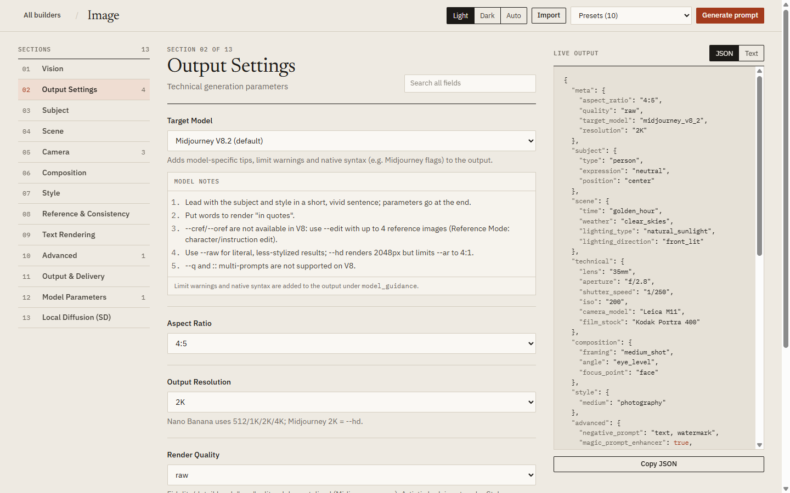](screenshots/image-builder.png) *Image builder: target model, model notes and live output* |
| [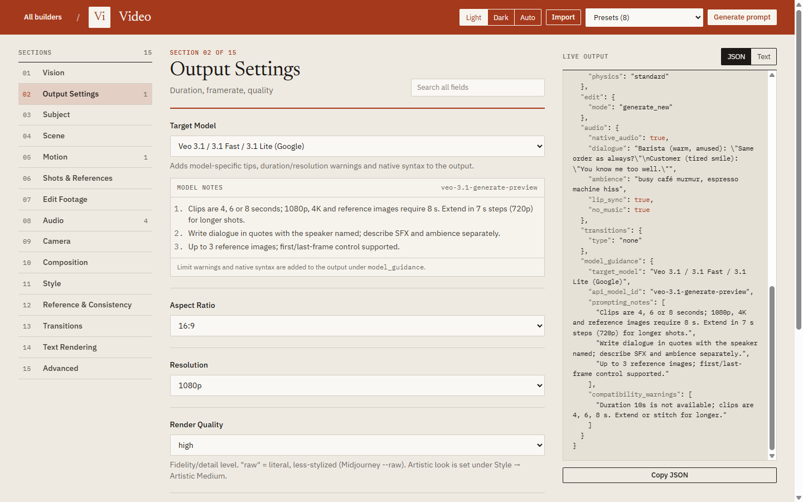](screenshots/video-builder.png) *Video builder: model guidance flags a 10 s clip on Veo 3.1* | [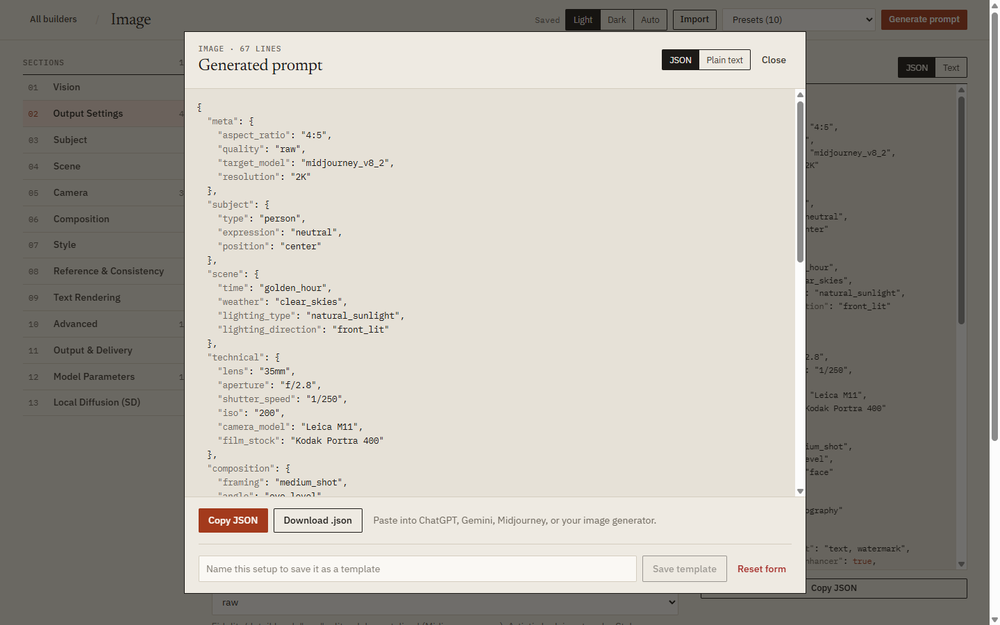](screenshots/json-output.png) *Generated prompt: JSON or plain text, copy, download or save* |
| [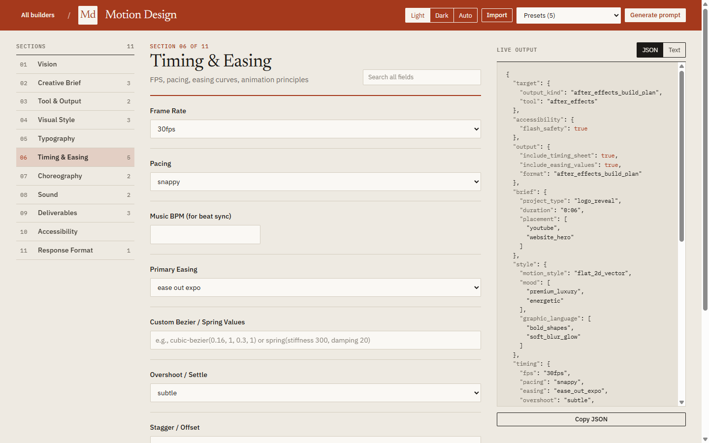](screenshots/motion-builder.png) *Motion Design builder: timing, easing and the 12 principles* | [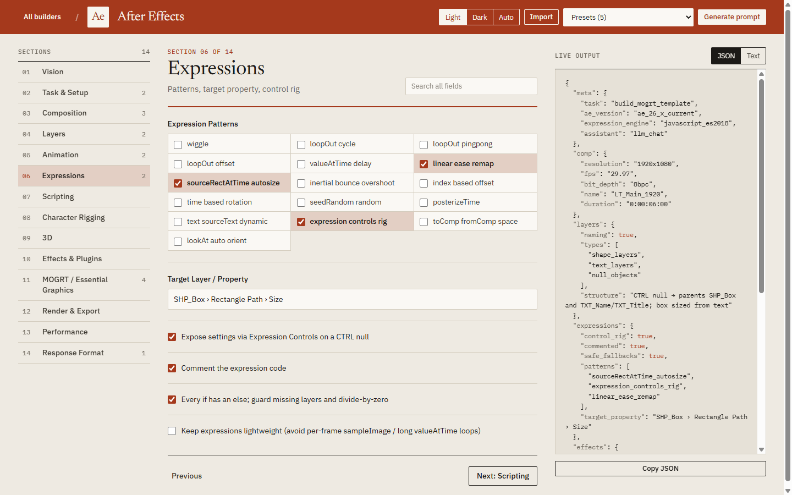](screenshots/aftereffects-builder.png) *After Effects builder: expression patterns for an auto-sizing MOGRT* |
| [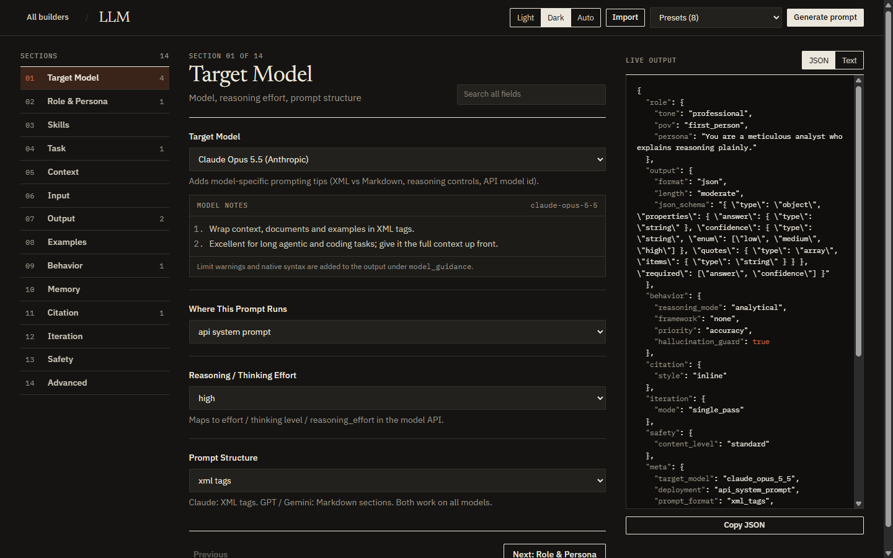](screenshots/llm-builder-dark.png) *LLM builder in dark mode with Claude Opus 5.5 notes* | [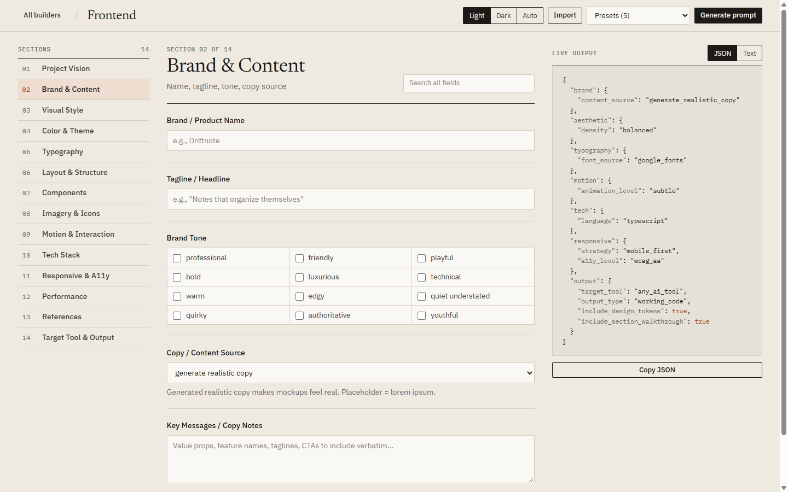](screenshots/frontend-builder.png) *Frontend Design builder: brand and content* |
| [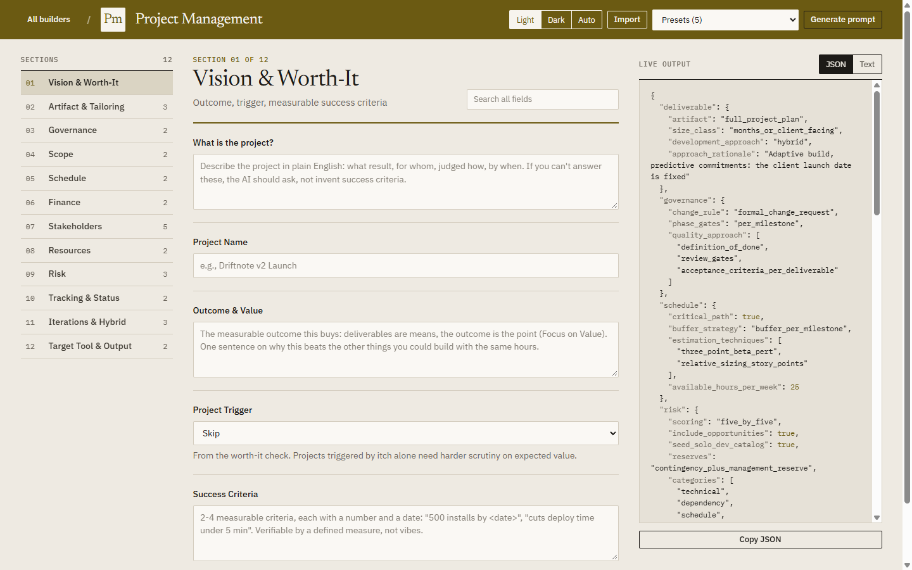](screenshots/pm-builder.png) *Project Management builder: PMBOK 8 Seven Questions* | [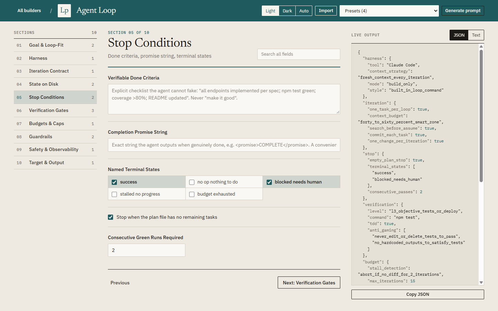](screenshots/loop-builder.png) *Agent Loop builder: stop conditions and verification gates* |
| [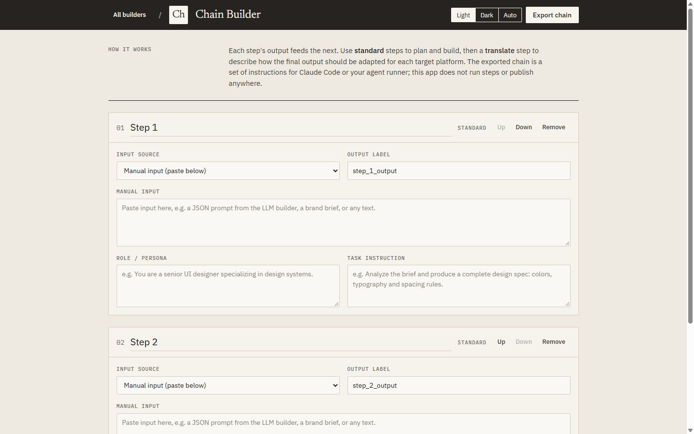](screenshots/chain-builder.png) *Chain Builder: multi-step pipelines* | |

Click any thumbnail to view full size.

## The Builders

The home screen is laid out like a periodic table. Each builder is an element tile, and color marks its family.

### Media (rust)

- **Image Prompt Builder.** Target-model picker for 30 models: GPT Image 2.5 Flare and Sunburst, Nano Banana 2, Lite and Pro, Midjourney V8.2, V7 and Niji 7, FLUX.2 and FLUX 3, Ideogram 4, Recraft V4.1, Seedream 5, Qwen-Image 2.1, Firefly Image 5, local SD 3.5 and SDXL, and more. Covers subject, scene, camera, lighting, composition, style, text layout, multi-reference and instruction edits, output format (SVG, layered, transparent), Midjourney parameters and local diffusion settings. Output includes ready-to-paste Midjourney flags or A1111/ComfyUI infotext, and warns about unsupported ratios, resolutions, reference counts and negative prompts.
- **Video Prompt Builder.** Target-model picker for 22 models: Gemini Omni Flash, Veo 3.1, Kling 3.0 (Omni, Turbo, Motion Control), Runway Gen-4.5 and Aleph, Luma Ray3.2, Seedance 2.x, MiniMax H3, Wan 3.0, LTX-2.5, Vidu Q3, Grok Imagine Video 1.5, Midjourney Video and more. Adds multi-shot storyboards, first and last frames, reference images, videos and audio (Seedance `@Image1` tokens), motion transfer, edit-existing-footage modes, timestamped action, dialogue with lip-sync, and duration and resolution checks per model.
- **Motion Design Prompt Builder.** A tool-agnostic motion brief for logo reveals, kinetic typography, UI micro-interactions, explainers, social ads and more. Targets After Effects, Jitter, Lottie Creator, Rive, Cavalry, Spline, code (GSAP, Motion, Remotion) or any AI video model. Covers style, typography animation, timing and easing (including the 12 principles of animation), choreography and transitions, sound sync, deliverables (Lottie, .riv, ProRes 4444, safe zones) and accessibility.
- **After Effects Prompt Builder.** Technical AE 26.x build prompts for an LLM, the AE AI Assistant, an AE MCP server or a human: comp setup, layer structure, keyframing and easing, expressions (JavaScript or legacy engine), ExtendScript and ScriptUI automation, Duik rigging, Advanced 3D with native shapes and Substance materials, native and third-party effects, MOGRTs, rendering and performance.
- **Audio Prompt Builder.** For Suno v6, Udio, ElevenLabs v3, Music and SFX, Lyria 3.5, Stable Audio 3, MiniMax, and Gemini and OpenAI TTS. Covers genre, mood, BPM, key, time signature, dynamics, lyrics with section tags, voice design, inline delivery tags, multi-speaker dialogue, pronunciation, a sound-effects section, loudness targets, stems and licensing.

### Language & Agents (teal)

- **LLM Prompt Builder.** Target-model picker for Claude Fable 5.1, Opus 5.5, Sonnet 5 and Haiku 4.5, GPT-6, Gemini 3.8, Grok 4.7, DeepSeek, Qwen, Kimi, GLM, Llama and local models (with API model ids), plus reasoning effort, prompt structure (XML or Markdown), JSON Schema output, prefill and stop markers. Covers role and persona, task, context, output format, behavior frameworks (ROSES, CO-STAR, PTCF and others), memory, citation, iteration and safety. Includes an industry skills picker with 25+ domains.
- **Agent Prompt Builder.** For tool-using and multi-agent systems (Claude Agent SDK, Claude Managed Agents, MCP, LangGraph, Microsoft Agent Framework and more). Covers objective and evals, tool surface and permission mode, reasoning loop and subagent roles, memory strategy, guardrails (prompt-injection defense, approval checkpoints, tracing) and output.
- **Agent Loop Prompt Builder.** For loop engineering (the Ralph technique): running coding agents in continuous loops with fresh context per iteration. Covers harness styles, iteration contracts, file-based state (plan file, AGENTS.md, blockers), verifiable stop conditions, anti-reward-hacking verification gates, budgets and stall detection, and sandbox isolation, including the honest caveats.

### Software (indigo)

- **Dev Prompt Builder.** Full-stack specs for web, mobile, desktop and APIs: vision, foundation, tech stack, architecture, frontend, backend, database, auth, API design, testing, DevOps, security, performance, documentation and project management.
- **Vibe Coder Prompt Builder.** Build web apps with AI coding tools, guided by The Vibe Coder's Handbook: 14 tech-stack decisions (runtime, framework, styling, database, auth, deploy) with inline guidance for each choice, targeting Cursor, Claude Code, Codex, Kiro, Bolt, Lovable, Replit and others.
- **Frontend Design Prompt Builder.** For v0, Lovable, Bolt, Claude Code, Cursor, Figma Make and Framer AI. Covers visual design language (30 aesthetic directions, color systems, typography), layout, components, imagery, motion and interaction, frontend tech stack, responsive and accessibility targets, performance budgets and design references.

### Business (bronze)

- **Marketing Prompt Builder.** Campaign strategy, audience, content, channels, brand voice, SEO and AI-search visibility, social, email, advertising, analytics, AI tools, compliance, copywriting, visuals and market research.
- **Project Management Prompt Builder.** Grounded in the PMBOK Guide 8th Edition: the Seven Questions (one per performance domain), development-approach tailoring (predictive, adaptive, hybrid), project size classes, kill criteria, EVM-lite tracking (SPI, CPI, EAC), risk registers with P×I scoring and AI-delegation planning. Generates prompts for 21 artifact types, from charters and full plans to status reports, sprint plans, retrospectives and plan audits.

### Pipelines (ink)

- **Chain Builder.** Multi-step prompt pipelines where each step's output feeds the next. Translate steps describe adaptations for 30+ platform targets (Canva, Figma, GitHub, Vercel, n8n, After Effects, Lottie Creator, Rive and more). Exported chains are instructions for Claude Code or your agent runner; the studio does not execute them.

## Features

| Feature | Description |
|---------|-------------|
| Model-aware output | Pick a target model or tool and the output gains a `model_guidance` block: prompting tips, API model id, compatibility warnings and native syntax |
| Live output | JSON or plain-text preview beside the form on wide screens, updated as you type |
| Schema-driven forms | All forms are generated from schema definitions; the section list shows how many fields you changed in each section |
| Presets | 74 one-click presets across the builders (Midjourney V8.2 Editorial, Veo 3.1 Dialogue Scene, Logo Reveal, Auto-sizing Lower Third, and more) |
| Templates | Save, open and delete your own templates in the browser; export or import the whole library as a file |
| Import / export | Paste a previously exported prompt (nested or flat JSON) to repopulate a builder |
| Field search | Search fields by name across every section of a builder |
| Sentinel values | Any dropdown can be set to Skip, None, Ask me about it, or Pick the best fit |
| Industry skills | 25+ industry domains with ten skills each for LLM personas |
| Medium aesthetics | 10 artistic mediums with curated aesthetic keywords |
| Themes | Light, Dark or Auto, applied before first paint so dark mode never flashes |
| Auto-save | Debounced auto-save with a resume-or-discard notice on your next visit |

## Design

The interface is warm paper and ink with one deep hue per builder family (rust, teal, indigo, bronze, ink). Each builder screen takes its family's color for its header band and accents. Typography is Newsreader for headings, IBM Plex Sans for text and IBM Plex Mono for labels and code. Corners are square, lines are hairline, and there are no shadows, gradients or icon sets. A skeleton loader shows while the app starts.

## Tech Stack

- **React 18** (CDN, pinned with integrity hashes)
- **Babel Standalone** (in-browser JSX compilation, pinned)
- **Tailwind CSS 3** (Play CDN) with a small token-based design system
- **Newsreader, IBM Plex Sans, IBM Plex Mono** (Google Fonts)
- **localStorage** for templates, chains, theme and auto-save

The browser app is a single HTML file with no build step. It loads React, Babel, Tailwind and its fonts from CDNs; without a connection the fonts fall back to Georgia and system fonts. The optional MCP service and the tests use Node.js 22+ and pinned npm dependencies.

## Reliability and agent access

- Validates imported prompts, template libraries, recovery records and saved chains before using them.
- Rejects unsafe property paths and malformed values, and limits imports to 1 MiB.
- Generates JSON and plain text from one shared core, used by both the browser and the MCP server.
- Uses each template's own schema for previews, so hidden fields stay excluded.
- Keeps reset, restore, save and auto-save state consistent.
- Prevents broken chain dependencies and duplicate output labels.
- Offers five optional MCP tools over stdio and authenticated Streamable HTTP; `get_builder` also returns the target-model profiles. See [PC/Pi setup and tool usage](mcp/README.md).

Run `npm ci --ignore-scripts` and `npm test` to check the shared core, preset validity and both MCP transports. No npm install is needed for normal browser use.

Model names, limits and syntax are guidance checked against vendor documentation on 2026-09-25, not guarantees of a provider's current API. Templates stay in the browser and origin where you saved them; use **Export all** before moving between file URLs, localhost or another machine.

## Browser Support

Any modern browser: Chrome, Edge, Firefox and Safari, on desktop and mobile.

## License

MIT
